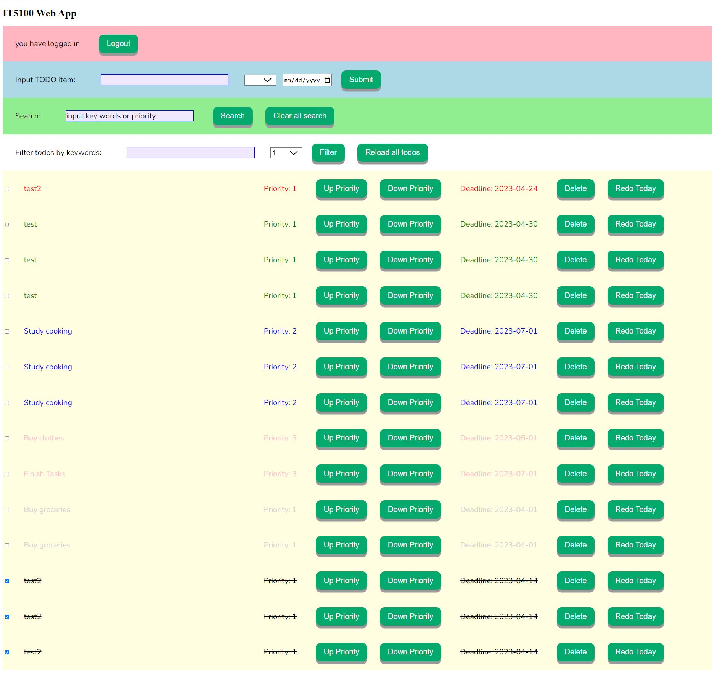

# IT5100A 2023 - Project

## How to run this project

In sbt shell, pleaes input "sjs/fastOptJS", "compile", "run" in sequence seperately. 

Or you could only input "myRun" for quickStart, because I implement
following in build.sbt:

    addCommandAlias("myRun", ";sjs/fastOptJS; compile; run")
##  Please setup Postgresql database myapp with users and todo table

    CREATE TABLE IF NOT EXISTS todo (
    "id" SERIAL PRIMARY KEY ,
    item VARCHAR(255) NOT NULL,
    priority VARCHAR(255),
    deadline VARCHAR(255),
    finished BOOLEAN NOT NULL DEFAULT false,
    overdue BOOLEAN NOT NULL DEFAULT false,
    urgent BOOLEAN NOT NULL DEFAULT false,
    userId int NOT NULL
    );
    
    CREATE TABLE IF NOT EXISTS "users" (
    "id" SERIAL PRIMARY KEY,
    username VARCHAR(50) NOT NULL,
    email VARCHAR(255) NOT NULL UNIQUE,
    hashedPassword VARCHAR(255) NOT NULL,
    token VARCHAR(255) DEFAULT NULL,
    tokenExpiration TIMESTAMP WITH TIME ZONE DEFAULT NULL
    );

##  Attention please

* In postgresql database, I create two table named 'todo' and 'users' in 'myapp' database to store data.
If the same tables have already existed, please delete them first. 

* Before running this project for first time, please check and delete previous localStorage in Chrome in developer mode.

## Features has already implemented:

  * Add multi-user ( the token will kept in localStorage unless you logout): 
       * Add login with plain text password
       * Implement OAuth standard where, after authentication has been 
         done, a token key is used to continue authentication during the session.

  * Add a checkbox that can be checked or unchecked 
    (useful for keeping track of correlated tasks)
       * Once a checkbox has been checked, cross the item with a horizontal line.

  * Implement reorder the priority order.

  * Implement priorities (1 to 3) and color the items differently by priority.
1st priority is Green color, 2nd priority is blue color and 3rd priority is pink color.

    
  * Implement REDO, if you press "Redo today" button, the same 
todo will be added with today as deadline.

  * Implement "Search" by keyword.

  * Implement filtering by keyword or priority.

  * Add deadline for each item.
       * Highlight items whose deadline is exceeded, and its color is grey.
       * Highlight items close to the deadline in a "warning" color, and its color is red.

